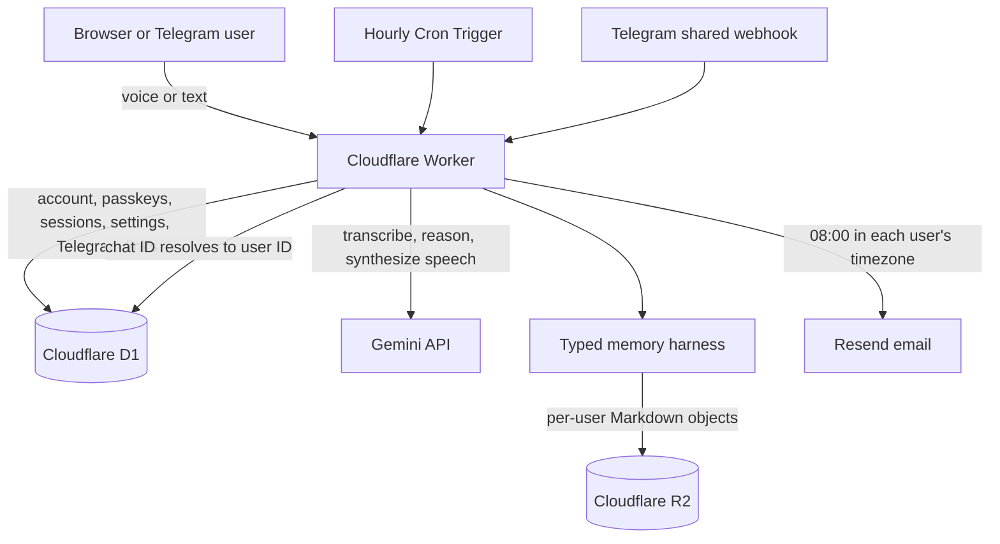

# Noter

Talk to it in the browser. It transcribes what you say (`gemini-3.5-transcribe`), stores the raw capture, lets a Gemini Flash agent (`gemini-3.5-flash-lite`) organize useful persistent memory, and acknowledges the capture with Gemini TTS (`gemini-3.8-flash-lite-tts`). Telegram voice notes use the same pipeline.

Production: https://noter.7p80u8m6.workers.dev

## Problem, solution, and how it works

Thoughts rarely arrive as clean tasks or calendar entries. A person may mention a commitment, an uncertain idea, and a question in the same sentence. Conventional note-taking tools make the person stop, classify that information, and decide where it belongs. That friction is often enough to prevent capture entirely.

Noter is an external brain for those unstructured thoughts. The user speaks or types naturally; Noter preserves the original capture, extracts only information with future value, and organizes it into durable tasks, events, and general memory. The same interaction may also contain a question, which Noter answers from accumulated memory. No note type, form, or approval step is required.

The core flow is:

```text
speak or type
    -> transcribe when needed
    -> preserve an immutable inbox capture
    -> let the memory agent search prior context
    -> append useful derived Markdown memories
    -> answer the user's question, if any
    -> resurface relevant context through queries and morning briefings
```

The raw inbox is evidence and is never changed by the agent. Derived memories are also create-only: when later information corrects an earlier belief, the agent writes a new file instead of silently rewriting history. This deliberately small, inspectable design tests the central product idea without requiring a vector database or a rigid personal-information ontology.

## Architecture



The Cloudflare Worker is the production application boundary. It serves the static PWA, verifies passkeys, scopes every protected request to a user, calls Gemini, runs the memory harness, accepts Telegram updates, and runs scheduled briefings. D1 stores structured control data; R2 stores the contents of each user's virtual Markdown filesystem.

## Technology inventory

| Technology | Role |
| --- | --- |
| TypeScript and Bun | Application language, tests, and package runner |
| Cloudflare Workers and Static Assets | Production API runtime and PWA hosting |
| Cloudflare D1 | Users, passkey credentials, challenges, sessions, settings, briefing delivery state, and Telegram links |
| Cloudflare R2 | Persistent per-user Markdown memory |
| Gemini API | Voice transcription, agent reasoning, query answers, briefings, and browser speech synthesis |
| Condense | OpenAI-compatible proxy that compacts memory-agent conversations before forwarding them to Gemini |
| WebAuthn via SimpleWebAuthn | Passwordless passkey registration and authentication |
| Zod | Request, tool-input, and Markdown-frontmatter validation |
| Resend | Delivery of morning briefing email |
| Telegram Bot API | Text and voice capture through a shared production webhook |
| Wrangler | Local Worker development, migrations, secrets, previews, and deployment |
| Node.js | Local development server (`dev.mjs`) that runs the Worker and works behind an egress proxy |

## Run it

You need Gemini and Condense API keys. Get the Gemini key at https://aistudio.google.com/apikey. The Condense account must have its proxy and custom-upstream capability enabled.

```sh
printf 'GEMINI_API_KEY=%s\nCONDENSE_API_KEY=%s\n' 'your-gemini-key' 'your-condense-key' > .dev.vars
bunx wrangler d1 migrations apply noter-accounts --local
bun run dev
```

Open http://localhost:8787. Hold the circle, talk, and let go. A single recording can contain information to remember, questions about existing memory, or both. The agent stores useful new information and speaks its answer; a capture without a question receives a short acknowledgement. Within one page session, follow-ups like "actually, change that to 4 o'clock" or "say that again?" work, because the last six exchanges are kept.

The sign-in screen always asks for an email and a passkey. A new email silently creates an account; an existing email signs in—there are no passwords. Passkeys work on `localhost` and on HTTPS; the relying-party ID and origin come from the request URL.

`bun run dev` runs the Worker locally in Cloudflare's runtime, with D1 and R2 kept in `.wrangler/state`, and reloads when you save. Unlike plain `wrangler dev`, it sends the Worker's outgoing requests, WebSockets included, through Node, so it also works behind an egress proxy: set `HTTPS_PROXY` and `NODE_USE_ENV_PROXY=1`.

## Authenticated API

The capture and query endpoints require the `noter_session` HttpOnly cookie issued after passkey authentication. Browser requests include it automatically. Non-browser clients should authenticate through WebAuthn and retain the returned cookie.

### Endpoint reference

| Method and path | Authentication | Purpose |
| --- | --- | --- |
| `POST /api/auth/options` | Public | Accept an email and return either passkey registration or authentication options. |
| `POST /api/auth/register/verify` | Public ceremony | Verify a new passkey, create the account, and issue a session cookie. |
| `POST /api/auth/login/verify` | Public ceremony | Verify an existing passkey and issue a session cookie. |
| `GET /api/auth/me` | Session | Return the signed-in user. |
| `POST /api/auth/logout` | Session | Revoke the current session and clear its cookie. |
| `POST /api/capture/text` | Session | Preserve text in `/inbox`, process it, and return created and accessed paths plus a response. |
| `POST /api/query` | Session | Answer a question from stored memory without creating a capture. |
| `POST /api/talk` | Session | Transcribe uploaded audio, process capture and query content together, and return synthesized audio: WAV by default, streamed raw PCM with `Accept: audio/l16`. |
| `GET /api/talk/live` | Session | WebSocket: audio streams in while the user talks and is transcribed live; the reply streams back on the same socket. |
| `GET /api/settings/briefing` | Session | Read morning-briefing settings. |
| `POST /api/settings/briefing` | Session | Enable or disable briefings and save the user's IANA timezone. |
| `GET /api/settings/telegram` | Session | Report whether this account has a linked Telegram chat. |
| `POST /api/settings/telegram/link-code` | Session | Register the shared webhook and create a single-use, ten-minute link code. |
| `POST /api/telegram/webhook` | Telegram secret | Receive Telegram updates; this is authenticated using Telegram's webhook secret rather than a user cookie. |

`POST /api/auth/options` makes sign-up and sign-in one flow: an unknown email receives registration options, while an existing email receives authentication options. Verification produces a random 30-day session token. Only its SHA-256 hash is stored in D1; the browser receives the original in a `Secure`, `HttpOnly`, `SameSite=Strict` cookie. WebAuthn challenges are single-use and expire after five minutes. In production, the relying-party ID and expected origin are derived from the request URL, so passkeys remain bound to the actual HTTPS deployment domain.

Capture unstructured text:

```sh
curl -sS localhost:8787/api/capture/text \
  -H 'content-type: application/json' \
  -d '{"text":"Ask Erik about deployment tomorrow"}'
```

The response includes the immutable inbox capture, derived paths, files consulted by the agent, and its user-facing response. Questions can be included in the same text as information to remember:

```json
{"capture":{"path":"/inbox/...md","id":"..."},"createdPaths":["/tasks/ask-erik-about-deployment.md"],"accessedPaths":[],"response":"Captured."}
```

Query accumulated memory:

```sh
curl -sS localhost:8787/api/query \
  -H 'content-type: application/json' \
  -d '{"question":"What do I need to discuss with Erik?"}'
```

```json
{"answer":"You need to discuss deployment with Erik.","accessedPaths":["/tasks/ask-erik-about-deployment.md"]}
```

Each response is scoped to the signed-in account. An unauthenticated request returns `401`.

## Memory

Each account has an isolated Markdown filesystem in R2, namespaced by user ID:

```text
/inbox/  /tasks/  /events/  /memory/  /briefings/
```

Account, passkey, challenge, session and conversation state lives in D1. The backend creates immutable raw files under `/inbox`. The agent receives only the typed `read_memory`, `list_memory`, `search_memory`, and create-only `write_memory` tools; when all of memory fits in its prompt, it gets only `write_memory`, since looking anything up would only cost time. It has no shell or raw storage tool and cannot write to `/inbox`. Empty memories and exact copies of an existing memory are refused.

Telegram requires a linked passkey account and uses that account's memory. Unlinked chats cannot invoke Gemini or the agent.

## Voice

The page records while you hold the circle and streams the audio over `GET /api/talk/live`, so the transcript is ready about 0.4 s after you let go. The reply streams back as raw 24 kHz mono 16-bit PCM and plays as it arrives. If the live connection fails, the page uploads the recording to `POST /api/talk` instead, with the same streamed reply.

Telegram accepts both voice notes and text, and replies with text. Keeping replies textual avoids CPU-heavy audio encoding inside the Worker.

## Telegram

1. In Telegram, message [@BotFather](https://t.me/BotFather), send `/newbot`, and pick a name and a username ending in `bot`.
2. Configure `TELEGRAM_BOT_TOKEN` as a Worker secret (or in `.dev.vars` locally).
3. Sign in to Noter, open Settings, and select **Generate code** under Telegram.
4. Send `/link CODE` to the bot within 10 minutes.
5. Send your bot a voice note or text message. It uses the same memory as your web account and answers in kind.

The Worker receives Telegram updates on one shared `POST /api/telegram/webhook`. Generating a link code configures that HTTPS webhook with `setWebhook`. Telegram signs deliveries with `TELEGRAM_WEBHOOK_SECRET`; the Worker then maps the incoming chat ID to a Noter user in D1. It does **not** register one webhook per user. A webhook needs a public URL, so to try the bot against a local Worker, expose it through a tunnel. If something breaks, the chat only gets an error line and the details go to the Worker logs.

For Cloudflare, configure both secrets before generating a production link code:

```sh
bunx wrangler secret put TELEGRAM_BOT_TOKEN
bunx wrangler secret put TELEGRAM_WEBHOOK_SECRET
```

Keep the bot token and webhook secret private. Whoever has the bot token controls the bot; if it leaks, send `/revoke` to BotFather and replace the Worker secret.

An unlinked Telegram chat receives linking instructions and cannot call Gemini or access memory. Link codes are single-use, expire after 10 minutes, and require an authenticated Noter session to create.

## Deploy to Cloudflare Workers

The Worker deployment uses Cloudflare-native persistence: D1 stores accounts, passkeys, challenges, and sessions; R2 stores each account's immutable Markdown memory; Workers Static Assets serves the browser UI. The passkey RP ID and origin are derived from the deployed request URL, so both `workers.dev` and custom HTTPS domains work without rebuilding.

The production Worker is currently available at https://noter.7p80u8m6.workers.dev.

Authenticate Wrangler and create the two persistent resources once:

```sh
bunx wrangler login
bunx wrangler d1 create noter-accounts
bunx wrangler r2 bucket create noter-memory
```

When deploying into another Cloudflare account, replace `database_id` in `wrangler.jsonc` with the ID returned by `d1 create`. Then configure the secret, migrate, and deploy:

```sh
bunx wrangler secret put GEMINI_API_KEY
bunx wrangler secret put CONDENSE_API_KEY
bunx wrangler d1 migrations apply noter-accounts --remote
bun run cf:deploy
```

For local development, see [Run it](#run-it).

### Morning briefings

Users can enable a daily email briefing from Settings. The browser saves their IANA timezone, an hourly Cron Trigger selects accounts whose local time is 08:00, and the memory harness synthesizes an immutable `/briefings/YYYY-MM-DD.md` before Resend delivers it. Daily database claims plus Resend idempotency keys prevent duplicates.

Add the Resend secret before deploying:

```sh
bunx wrangler secret put RESEND_API_KEY
```

The default sender is `Noter <onboarding@resend.dev>`, which is suitable for Resend testing. After verifying a sending domain, change `RESEND_FROM` in `wrangler.jsonc` to an address on that domain.

## Technical evaluation guide

### Multi-user isolation and persistence

Every authenticated request resolves the opaque session token to one D1 user ID before it can reach capture, query, settings, or linking logic. The Worker constructs the memory store with that user ID, and all R2 keys are namespaced under it. The agent only sees virtual paths such as `/tasks/follow-up.md`; it never sees an R2 key, host path, or another user's namespace. Telegram follows the same boundary: a chat ID must first resolve through `telegram_links` to a user ID, after which it enters the same capture pipeline as the website.

D1 and R2 have intentionally different responsibilities. D1 holds relational control data that needs lookup and uniqueness constraints: identities, public passkey credentials, short-lived challenges, hashed sessions, preferences, delivery claims, and Telegram associations. R2 holds the human-readable memory documents. This keeps memory portable and inspectable while still giving account and delivery workflows transactional storage.

### Passkeys and account lifecycle

The user enters an email and performs one passkey ceremony. If the email is new, successful WebAuthn registration creates the account and credential; if it already exists, successful authentication signs the user in. Private key material never reaches Noter. The server stores the public credential and counter in D1, requires user verification, checks the challenge, origin, and relying-party ID, and then creates a revocable session. The email identifies the intended Noter account and is also the briefing destination; the passkey proves possession of the credential registered to that account.

### Append-only memory harness

Each capture first becomes an immutable Markdown document under `/inbox`. The agent has four narrow tools—`read_memory`, `list_memory`, `search_memory`, and `write_memory`—rather than shell or unrestricted filesystem access. Search is deterministic and grep-like, frontmatter is validated with Zod, and writes are atomic create-only operations. The agent cannot write to `/inbox`, overwrite a path, edit, move, or delete a file. It may produce zero, one, or several derived files under `/tasks`, `/events`, or `/memory`, and the query response separately reports which paths were accessed for provenance without putting source citations in the user-facing answer.

Production implements the same logical contract over R2, with objects namespaced by user.

### Scheduled morning briefings

An hourly Cloudflare Cron Trigger scans only users who enabled briefings. For each user, the Worker converts the current time into the saved IANA timezone and proceeds when the local hour is `08:00`. A conditional D1 update claims that user's local date before generation, preventing duplicate deliveries from overlapping or repeated invocations. The agent reads derived memory—not only the latest inbox item—synthesizes a concise `/briefings/YYYY-MM-DD.md` artifact in the user's R2 namespace, and Resend emails it. If generation or delivery fails, the date claim is released for a later retry; successful delivery records its timestamp.

### Security boundaries and deliberate V0 constraints

- The agent has no raw shell, filesystem, D1, R2, authentication, email, or Telegram tool.
- User scoping is enforced by the Worker and storage adapter, not by prompting the model.
- Raw captures and derived memories remain available for audit because agent writes are append-only.
- Telegram rejects requests without the configured webhook-secret header, and unlinked chats cannot invoke Gemini or access memory.
- The system deliberately uses deterministic file search rather than embeddings or hidden relevance scoring. This keeps retrieval behavior inspectable for the prototype.

## Test

```sh
bun test
```

Gemini is mocked in the tests, so no key is needed.

## Troubleshooting

- **The page shows a `502` with a Gemini error.** The message names the model that failed and includes Google's own error text. A `400` from `gemini-3.5-transcribe` usually means it rejected the audio format (Chrome records WebM). A `404` means your key can't reach that model ID; change it in `gemini.ts`. A `403` means the key is wrong.
- **The page shows a Condense or Gemini error.** Check that `GEMINI_API_KEY` and `CONDENSE_API_KEY` are set in `.dev.vars` locally and as Worker secrets in production. The Condense account also needs custom-upstream access so the proxy can forward to Gemini's OpenAI-compatible API.
- **Passkey creation or sign-in fails.** Outside localhost, HTTPS is required, and a passkey only works on the domain it was created on.
- **The mic doesn't start.** Browsers only allow the microphone on `localhost` or HTTPS. Open the page at `localhost`, not at your LAN IP.
